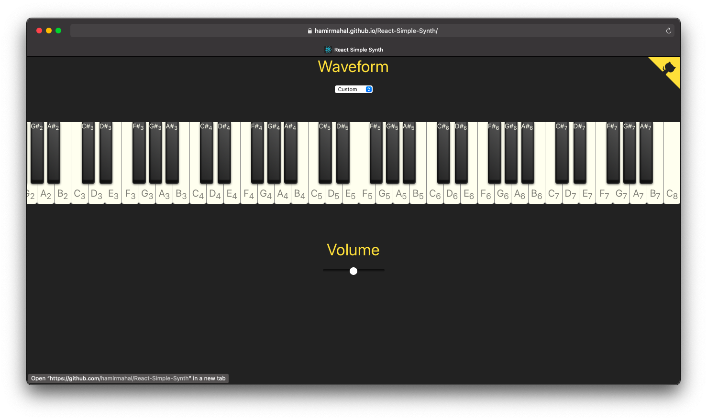

You can find a live demonstration of this repository at https://hamirmahal.github.io/React-Simple-Synth/.

This is a React version of the [simple synthesizer I made using plain JavaScript, HTML, and CSS](https://github.com/hamirmahal/simple-synth).

[That synthesizer](https://github.com/hamirmahal/simple-synth) used https://developer.mozilla.org/en-US/docs/Web/API/Web_Audio_API/Simple_synth as its foundation.

Both [that synthesizer](https://github.com/hamirmahal/simple-synth) and this, React-based one use styling from [a CSS Piano I found through a search](https://codepen.io/zastrow/pen/oDBki).

This is how this synthesizer looks without an active night theme.

This is how this synthesizer looks with an active night theme.

